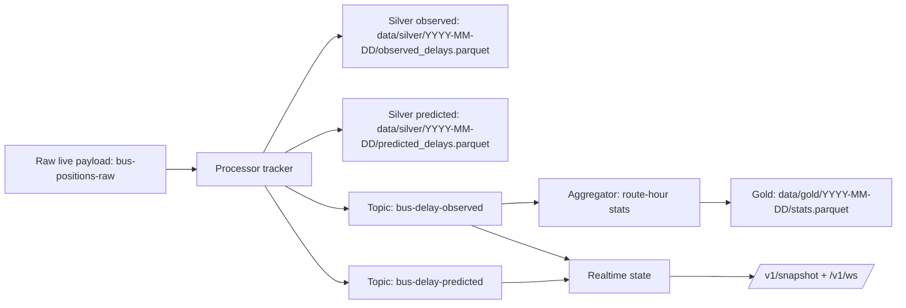

# Delay: How It Works

This page explains current delay generation and usage across the stack.

## 1) Runtime model

Delay is split into two streams:
- observed delay for stops that have been reached
- predicted delay for upcoming stops on the same tracked trip

Observed value:

```text
delay_seconds = observed_time - scheduled_time
```

Predicted value is based on the tracker's smoothed offset from observed progression.

## 2) End-to-end flow



## 3) Tracker behavior

Implementation: `internal/processorlogic/tracker.go`.

For each live bus row:
1. Validate required fields (`lon`, `lat`, `voznja_bus_id`).
2. Resolve trip via `TripIDResolver` (default maps `voznja_bus_id` to `PolazakID` string).
3. Match nearest stop on the locked trip plan within station radius.
4. Enforce monotonic stop progression (`station_seq` must move forward).
5. Compute observed delay for the reached stop.
6. Compute smoothed delay offset (EMA) and fan out predictions to remaining stops.

Skip reasons are emitted through `SkipReason*` constants in `internal/processorlogic/tracker_types.go`.

## 4) Time alignment details

Timetable tokens are time-of-day strings. The tracker aligns them to service local time (`Europe/Zagreb`) and chooses the nearest day candidate around the observation timestamp.

This keeps midnight-boundary trips aligned while event timestamps remain RFC3339 UTC.

## 5) Contracts and consumers

- event contracts: `internal/contracts/delay.go`
- realtime contracts: `internal/contracts/realtime.go`
- topic constants: `internal/contracts/topics.go`

Consumer split:
- `cmd/aggregator` consumes `bus-delay-observed`
- `cmd/realtime` consumes `bus-delay-observed` and `bus-delay-predicted`

## 6) Operational migration cleanup

After switching to current topic and file names, remove old artifacts explicitly:

```bash
# remove old topic variants if they still exist
for topic in bus-delay-observed bus-delay-predicted; do
  docker compose exec redpanda rpk topic delete "${topic}-v2" || true
done

# remove old silver files if present
find data/silver -type f -name '*_delays_v2.parquet' -delete
```
