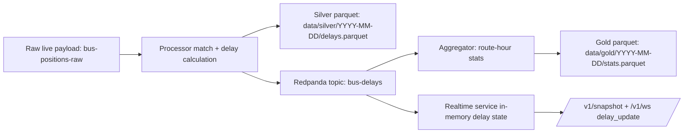

# Delay: How It Works

This document explains how "delay" is produced and used across the system, from raw bus positions to realtime UI and Gold aggregations.

## 1) Delay Definition

At runtime, delay is computed as:

```text
delay_seconds = actual_time - scheduled_time
```

- `delay_seconds > 0`: vehicle is late
- `delay_seconds = 0`: exactly on schedule
- `delay_seconds < 0`: vehicle is early

`actual_time` and `scheduled_time` are emitted as RFC3339 timestamps in UTC in the delay event payload.

## 2) End-to-End Delay Flow



## 3) Processor Matching Algorithm (Source of Truth)

Implementation: `internal/processorlogic/delay.go`, called from `cmd/processor/main.go`.

For each live bus row in `res`:

1. Validate required fields:
- coordinates (`lon`, `lat`) must exist
- `voznjaBusId` must exist

2. Find nearest station:
- Haversine distance against all stations with coordinates
- station must be within `< 100m` (default threshold)

3. Resolve trip and route context:
- find timetable rows by `PolazakId == voznjaBusId` (stringified)
- take `BrojLinije` from the first matched trip row
- find timetable rows by `(station_id, broj_linije)`

4. Choose scheduled stop time:
- parse timetable `Polazak` time-of-day
- align to `Europe/Zagreb` date context
- test day candidates `-24h`, `0h`, `+24h`
- choose closest candidate to actual observation
- accept only if absolute difference is `<= 15m` (default window)

5. Compute delay:
- `delay_seconds = actual_utc - scheduled_utc`

6. Emit outputs:
- write Silver row to `data/silver/YYYY-MM-DD/delays.parquet`
- publish `DelayEvent` JSON to `bus-delays`

### Skip Reasons

When a bus row cannot be enriched, processor skips it with one of:

- `missing_coordinates`
- `missing_voznja_bus_id`
- `no_station_within_100m`
- `no_line_for_polazak`
- `no_schedule_for_station_line`
- `no_schedule_within_window`

## 4) Time Alignment and Midnight Behavior

Timetable values are time-of-day strings (for example `23:59:00`), so processor anchors them to service local date and then checks neighboring days.

Example:

- `actual_time`: `2025-01-02T00:01:00Z`
- timetable `Polazak`: `23:59:00`
- nearest candidate becomes previous day `2025-01-01T23:59:00Z`
- computed delay: `+120` seconds

This is covered by `TestBuildDelayMidnightAlignmentUsesNearestDay` in `internal/processorlogic/delay_test.go`.

## 5) Delay Event Schema (`bus-delays`)

Go contract: `internal/contracts/delay_event.go`.

### Field Schema

| Field | Type | Required | Notes |
|---|---|---|---|
| `polazak_id` | string | yes | Timetable departure/trip key |
| `voznja_bus_id` | int64 | yes | Live trip linkage key |
| `gbr` | int64 | no | Fleet identifier |
| `station_id` | int64 | yes | Matched station |
| `station_name` | string | yes | Human-readable station |
| `distance_m` | float64 | yes | Bus-to-station distance at match |
| `lin_var_id` | string | yes | Line variant |
| `broj_linije` | string | yes | Public route/line |
| `scheduled_time` | string | yes | RFC3339 timestamp (UTC) |
| `actual_time` | string | yes | RFC3339 timestamp (UTC) |
| `delay_seconds` | int64 | yes | Signed delay |

### Example Event (Late Bus)

```json
{
  "polazak_id": "123",
  "voznja_bus_id": 123,
  "gbr": 77,
  "station_id": 410,
  "station_name": "Delta",
  "distance_m": 28.4,
  "lin_var_id": "2A-1",
  "broj_linije": "2A",
  "scheduled_time": "2026-02-21T10:12:00Z",
  "actual_time": "2026-02-21T10:16:30Z",
  "delay_seconds": 270
}
```

### Example Event (Early Bus)

```json
{
  "polazak_id": "456",
  "voznja_bus_id": 456,
  "station_id": 115,
  "station_name": "Trsat",
  "distance_m": 34.1,
  "lin_var_id": "8-2",
  "broj_linije": "8",
  "scheduled_time": "2026-02-21T11:00:00Z",
  "actual_time": "2026-02-21T10:58:40Z",
  "delay_seconds": -80
}
```

### JSON-Schema Style Contract

```json
{
  "type": "object",
  "required": [
    "polazak_id",
    "voznja_bus_id",
    "station_id",
    "station_name",
    "distance_m",
    "lin_var_id",
    "broj_linije",
    "scheduled_time",
    "actual_time",
    "delay_seconds"
  ],
  "properties": {
    "polazak_id": { "type": "string" },
    "voznja_bus_id": { "type": "integer" },
    "gbr": { "type": "integer" },
    "station_id": { "type": "integer" },
    "station_name": { "type": "string" },
    "distance_m": { "type": "number" },
    "lin_var_id": { "type": "string" },
    "broj_linije": { "type": "string" },
    "scheduled_time": { "type": "string", "format": "date-time" },
    "actual_time": { "type": "string", "format": "date-time" },
    "delay_seconds": { "type": "integer" }
  }
}
```

## 6) Silver Schema (`data/silver/YYYY-MM-DD/delays.parquet`)

Parquet row struct: `silverDelayRow` in `cmd/processor/main.go`.

In addition to delay fields, Silver stores ingestion and Kafka lineage metadata:

| Field | Type |
|---|---|
| `ingested_at` | string |
| `ingested_date` | string |
| `polazak_id` | string |
| `voznja_bus_id` | int64 |
| `gbr` | optional int64 |
| `station_id` | int64 |
| `station_name` | string |
| `distance_m` | float64 |
| `lin_var_id` | string |
| `broj_linije` | string |
| `scheduled_time` | string |
| `actual_time` | string |
| `delay_seconds` | int64 |
| `kafka_topic` | string |
| `kafka_partition` | int32 |
| `kafka_offset` | int64 |

## 7) Aggregation Logic (Gold)

Implementation: `internal/aggregatorlogic/aggregate.go`, wired in `cmd/aggregator/main.go`.

Bucket key:

- hour from `actual_time` (UTC truncated to hour)
- route (`broj_linije`, trimmed; fallback `unknown`)

Per bucket:

- `sample_count`
- `avg_delay_seconds`
- `p95_delay_seconds` (nearest-rank)
- `p99_delay_seconds` (nearest-rank)
- `on_time_percentage`

On-time rule:

```text
abs(delay_seconds) <= ARRIVAL_ON_TIME_SECONDS
```

Default `ARRIVAL_ON_TIME_SECONDS=300` (5 minutes).

### Gold Output Schema (`data/gold/YYYY-MM-DD/stats.parquet`)

| Field | Type |
|---|---|
| `date` | string |
| `hour_start_utc` | string |
| `route` | string |
| `sample_count` | int64 |
| `avg_delay_seconds` | float64 |
| `p95_delay_seconds` | int64 |
| `p99_delay_seconds` | int64 |
| `on_time_percentage` | float64 |
| `written_at` | string |

### Worked Aggregation Example

Input delays for route `2A` in `2025-01-02T10:00:00Z` bucket:

- `[-120, 0, 60, 300]`

Results:

- `sample_count = 4`
- `avg_delay_seconds = 60`
- sorted delays `[-120, 0, 60, 300]`
- `p95 = 300`
- `p99 = 300`
- with on-time threshold `60`, on-time events are `-120? no`, `0 yes`, `60 yes`, `300 no`
- `on_time_percentage = 50`

This behavior is tested in `internal/aggregatorlogic/aggregate_test.go`.

## 8) Realtime Delay Semantics

Implementation: `cmd/realtime/main.go`, `internal/realtime/*`.

Delay records from `bus-delays` are stored in-memory by key:

```text
delay_key = voznja_bus_id + ":" + station_id
```

Implications:

- newest event replaces older event for the same `(voznja_bus_id, station_id)`
- multiple stations for the same bus can coexist
- delay entries expire by TTL (default `90m`)

Snapshot API (`GET /v1/snapshot`) includes:

- `delays` array (current latest-state rows)
- `meta.delays_count`

WebSocket (`GET /v1/ws`) emits:

- `delay_update` envelopes with one `DelayEvent`
- `heartbeat` envelopes

Envelope shape:

```json
{
  "type": "delay_update",
  "ts": "2026-02-21T12:03:44.123456Z",
  "data": {
    "delay": {
      "polazak_id": "123",
      "voznja_bus_id": 123,
      "station_id": 410,
      "station_name": "Delta",
      "distance_m": 28.4,
      "lin_var_id": "2A-1",
      "broj_linije": "2A",
      "scheduled_time": "2026-02-21T10:12:00Z",
      "actual_time": "2026-02-21T10:16:30Z",
      "delay_seconds": 270
    }
  }
}
```

## 9) Configuration Knobs Related to Delay

| Variable | Default | Used by | Effect |
|---|---|---|---|
| `ARRIVAL_KAFKA_DELAY_TOPIC` | `bus-delays` | processor, aggregator, realtime | Delay topic name |
| `ARRIVAL_SILVER_DIR` | `data/silver` | processor | Silver output location |
| `ARRIVAL_GOLD_DIR` | `data/gold` | aggregator | Gold output location |
| `ARRIVAL_ON_TIME_SECONDS` | `300` | aggregator | On-time threshold |
| `ARRIVAL_REALTIME_DELAYS_TTL` | `90m` | realtime | Delay retention in memory |

Processor matching constants in code (currently not env-tunable):

- station distance threshold: `100m`
- schedule match window: `15m`
- service timezone for timetable anchoring: `Europe/Zagreb`

## 10) Operational Validation

Basic checks:

```bash
docker compose exec redpanda rpk topic consume bus-delays -n 1
```

Expect one JSON `DelayEvent`.

```bash
docker compose logs --tail=100 processor aggregator realtime
```

Look for:

- processor `stage=delay_publish`
- aggregator flush logs (`stage=gold_writer`)
- realtime state updates and websocket traffic

## 11) Known Constraints and Tradeoffs

- Matching uses nearest station only and fixed 100m radius.
- Schedule selection is time-window based; unmatched rows are intentionally skipped.
- `actual_time` is processing-time (`ingestedAt`) per consumed raw Kafka record.
- Gold files are rewritten on each flush for a date partition.
- Realtime store is latest-state, not full history.

